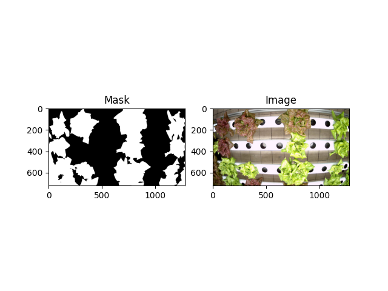

# Algorithm to Convert VIA to Mask 

## Step

### 1. VGG Image Annotator (VIA)
Use annotation editor from University of Oxford
https://www.robots.ox.ac.uk/~vgg/software/via/

### 2. Setup to match my code
- polygon 
- class 
- text \

### 3. Do annotation and export in CSV format

### 4. Prepare conv.json to match your classes
check setup/conv.json

### 5. Run the code
run without --save, only plotting. \
run with --save, saving. \
